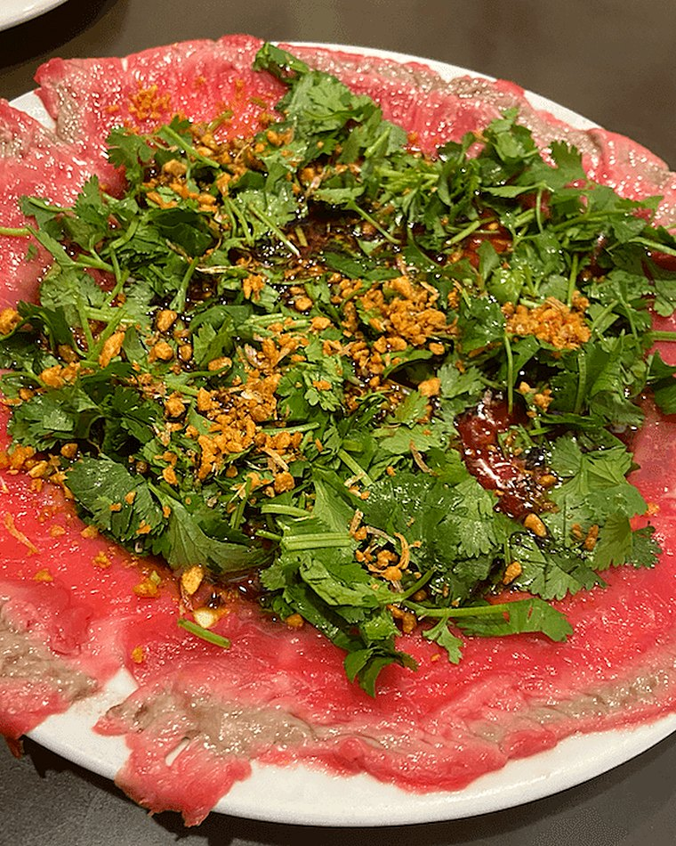

# Phnom Penh Restaurant — Design System

Single source of truth for every page on this site. Read this file before building or editing any page. If a value is not in this file, it does not go on the site until it is added here.

**Subject:** Phnom Penh Restaurant, 244 East Georgia Street, Vancouver Chinatown. Family run Cambodian and Vietnamese, open since 1985, third generation in the kitchen. Michelin Bib Gourmand 2022 through 2025.

**The page's job:** get someone to decide to walk in tonight, and tell them what to order when they do.

**Register:** premium and quiet. Light type, generous space, restrained gold. Not a busy neighbourhood-restaurant template.

---
## 1. Hard rules

These are non-negotiable across all pages.

1. Never introduce a colour, font, or size that is not defined in this file.
2. All styling lives in `/css/styles.css`. No inline styles, no `<style>` blocks in page files.
3. Header and footer come from `/partials/`. A page carries a slot, never a copy of the markup.
4. All behaviour lives in `/js/site.js`. No `<script>` blocks in page files.
5. Images are real files in `/images/`. Never base64, never embedded.
6. No em dashes and no semicolons anywhere in visible copy.
7. Every page uses the same nav, the same button style, and the same section rhythm.
8. The hero uses `svh`, never `vh`, so the buttons clear the Safari toolbar.
9. The site must be served over http. The partials are fetched at runtime and will not load from the file system.

---

## 2. Colour

The site is dark first. `--ink` is the ground and `--paper` is the text on it. Light sections are the exception.

```css
:root {
  --ink:         #242424;               /* the one dark ground, neutral charcoal, used site wide */
  --ink-2:       #242424;               /* kept for existing selectors, same charcoal as --ink */
  --ink-3:       #242424;               /* kept for existing selectors, same charcoal as --ink */
  --paper:       #F3E9DB;               /* warm cream, text on dark grounds */
  --surface:     #FBF9F4;               /* near white, the light section grounds */
  --paper-dim:   rgba(243,233,219,.66); /* secondary text on dark */
  --paper-faint: rgba(243,233,219,.40); /* tertiary text on dark */
  --red:         #C5302A;               /* accent, prices, rules, dots, nav underline */
  --red-deep:    #9E241F;               /* dark stop of red gradients */
  --gold:        #BF9C5C;               /* button borders, eyebrows, labels */
  --mint:        #57D7A5;               /* second accent, used sparingly, dark grounds only */
  --line:        rgba(243,233,219,.14); /* hairline on dark */
  --line-strong: rgba(243,233,219,.26); /* hairline on dark, hover */
  --maxw:        1240px;
  --ease:        cubic-bezier(.22,.61,.36,1);
}
```

**Usage discipline**

- `--ink` is the default ground. A page runs about five dark sections to two light ones. Light sections use `--surface` and exist to break up the dark, not the other way round.
- Text on dark uses the token ladder: `--paper`, then `--paper-dim`, then `--paper-faint`. Never invent a fourth step.
- Text on light has no tokens. It is ink at an alpha, `rgba(36,36,36,α)`. Use `.74` for body, `.6` for a lead or a caption, `.5` for meta. Nothing lighter than `.5`.
- Hairlines on dark use `--line`, and `--line-strong` only on hover. Hairlines on light are ink at an alpha, `.10` to `.18` for section rules, `.30` to `.32` for dotted leaders.
- Gold is a border and a label colour. It is never a fill for a large area. Its one fill is the button hover.
- Mint `--mint` is the second accent and the only cool colour in the palette. Use it sparingly, for one small element at a time, and only on dark grounds. It is too light for text or hairlines on the cream surfaces, and it never competes with red or gold in the same component.
- Flat `--red` is correct for small accents, the nav hover underline, the timeline dots, prices, and source labels. Red gradients exist but there is at most one per page, and the stops are `--red` to `#8E211C` at `155deg`.
- Never grey body text. Secondary text is ink or paper at an alpha, never a grey hue.

**Literals that are not tokens**

These are in the stylesheet as written values. Reuse them exactly, or promote one to a token in this file and the stylesheet at the same time.

| Value | Where |
|---|---|
| `#F6F1E9` | button text on dark and photo grounds |
| `#242424` | button text when the button fills with gold on hover |
| `#e9e2d5` | placeholder behind a photo while it loads |
| `#8E211C` | the dark stop of the featured news gradient |
| `rgba(36,36,36,.82)` to `rgba(36,36,36,.9)` | the scrim over the news photograph |
| `rgba(36,36,36,.5)` / `.55` / `.72` | news card grounds, resting and hover |
| `rgba(36,36,36,.8)` | dish tag ground on a photo |
| `rgba(36,36,36,.92)` | header ground once it solidifies |
| `#A62C26` and `#F3E9DB` | inside the Michelin emblem SVG |

---

## 3. Typography

One family. The personality comes from weight and letterspacing, not from a second typeface.

```css
body      { font-family: "Montserrat", system-ui, sans-serif; }
h1, h2, h3{ font-family: "Montserrat", sans-serif; font-weight: 300;
            line-height: 1.1; letter-spacing: .005em; margin: 0; }
```

Base body is `16.5px`, line height `1.65`, letter spacing `.01em`. At 560px and below it is `16px`.

| Role | Selector | Size | Weight | Tracking | Line height |
|---|---|---|---|---|---|
| Hero headline | `.hero h1` | `clamp(2.9rem,7vw,5.6rem)` | 300 | `.008em` | 1.06 |
| Section heading | every section `h2` | `clamp(2rem,4.6vw,3.3rem)` | 300 | `.005em` | 1.1 |
| Feature heading | `.nf-main h3` | `1.7rem` | 300 | `.005em` | 1.18 |
| Timeline year | `.mich-years span` | `2rem` | 300 | `.02em` | 1.1 |
| Mobile menu link | `.mobile-menu a` | `28px` | 300 | `.01em` | 1.65 |
| Hero sub | `.hero-sub` | `clamp(1.05rem,1.6vw,1.35rem)` | 400 | `.01em` | 1.55 |
| Lead on dark | `.legacy-lead` | `1.05rem` | 400 | `.01em` | 1.66 |
| Lead on light | `.pop-lead` | `1.02rem` | 400 | `.01em` | 1.6 |
| Body on light | `.mich-sub` | `1rem` | 400 | `.01em` | 1.6 |
| News card heading | `.nc h3` | `1.24rem` | 400 | `.005em` | 1.65 |
| Dish description | `.pop-why` | `.96rem` | 400 | `.01em` | 1.6 |
| Timeline label | `.mich-labels span` | `11px` | 400 | `.13em` | 1.45 |
| Footer meta | `.foot-bottom` | `12.5px` | 400 | `.04em` | 1.65 |
| Button | `.btn` | `12.5px` | 500 | `.2em` | 1 |
| Dish name | `.pop-body h3` | `1.22rem` | 600 | `.01em` | 1.1 |
| Nav link | `.nav-link` | `13px` | 600 | `.14em` | 1.65 |
| Eyebrow | `.eyebrow` | `12px` | 600 | `.26em` | 1.65 |
| Column label | `.visit-col h4` | `.74rem` | 600 | `.22em` | 1.65 |
| Footer label | `.foot-col h4` | `11px` | 600 | `.2em` | 1.65 |
| News source | `.nc-src` | `11px` | 600 | `.18em` | 1.65 |
| Dish tag | `.pop-tag` | `10px` | 600 | `.15em` | 1.65 |

Everything from `.btn` down in that table is uppercase. Everything above it is sentence case.

**Rules**

- There is one section heading size, set once on `.mich-h2, .legacy-h2, .pop-head h2, .news-head h2, .visit-head h2`. A new section heading joins that selector list. It is never sized locally.
- The type ladder is hero `89.6px`, section heading `52.8px`, card heading `27.2px`, dish name `19.5px`, body `16.5px`. Nothing nested inside a section may be larger than that section's heading.
- Weight 300 is the default for anything display sized. 400 is body. 500 is buttons only. 600 is every small uppercase label, every nav link, and dish names. 700 exists in the stylesheet for components that no page uses yet.
- The eyebrow always carries a `26px` gold rule before it at `.7` opacity. In light sections the eyebrow and its rule turn `--red`.
- The hero headline is one continuous clamp with no breakpoint override, so it scales smoothly from 46.4px at 375px to 89.6px at 1440px and never jumps at a boundary. Only two things resize on the phone tier: `.mich-years span` to `1.45rem` and `.mich-labels span` to `9.5px` at `.06em`. Nothing else.
- Long text is capped in `ch`, not pixels. The range in use is `14ch` for a tight headline to `58ch` for a paragraph. Pick from that range rather than inventing a pixel width.
- No other font family. A stray reference to another family is a bug.

---

## 4. Spacing and layout

There are no spacing tokens. Section padding is written per section, and the values below are the whole set.

```css
.wrap { max-width: var(--maxw); margin: 0 auto; padding: 0 28px; }  /* 0 20px at 560px */
```

The gutter is a fixed `28px`, dropping to `20px` at 560px.

| Section | Desktop, top / bottom | Mobile |
|---|---|---|
| `.hero` | `100vh`, `100svh` where supported. Inner `60px` / `74px` | `86svh` at 700px. Inner `40px` / `46px` |
| `.mich` | `98px` / `106px` | `76px` / `82px` at 600px |
| `.legacy` | `102px` / `110px` | unchanged |
| `.popular` | `104px` / `104px` | unchanged |
| `.news` | `104px` / `108px` | unchanged |
| `.visit` | `104px` / `106px` | unchanged |
| `.foot` | `82px` / `34px` | unchanged |

A new section uses `104px` top and bottom unless there is a reason to match a neighbour.

**Radius.** There is no single radius. `0` on buttons. `2px` on the focus ring and the dish tag. `3px` on every photograph and collage tile. `4px` on news cards and panels. `999px` on pill shaped tags. `50%` on the timeline dots.

**Gaps in use.** `12px` collage, `14px` button rows, `18px` news grid, `22px` rail, `28px` signature grid, `30px` dish grid, `40px` visit and footer columns, `64px` footer top.

**Breakpoints.** Two, and only two.

| | Boundary | What changes |
|---|---|---|
| `1024px` | desktop to tablet | Nav becomes the burger. Three up becomes two up. The footer top and the news feature stack. |
| `600px` | tablet to phone | Everything becomes one column. Gutter drops to `20px`, body to `16px`. |

Both blocks live at the end of the stylesheet so they win over every base rule regardless of where a component is declared. A component that seems to need a third breakpoint is a component that is wrong. There is also a `prefers-reduced-motion` block that stops every animation and transition.

The phone boundary is `600px` rather than something larger because the single column is as wide as the boundary, and past about `615px` a paragraph in one column runs over 75 characters.

---

## 5. Components

Build these once. Reuse them everywhere.

**Nav (sticky, shared partial)**
- `position: sticky`, not fixed. Nav height `80px`.
- Starts transparent over a gradient that fades the hero into the top of the page. Past `40px` of scroll, `js/site.js` adds `.solid`, which switches it to `rgba(36,36,36,.92)` with a `10px` backdrop blur and a `--line` bottom border.
- Desktop: logo left, links centred, gold outline Menu button right.
- Links: Our Story, Shop, Menu, Visit.
- At 920px and below the links and the Menu button hide, and the burger appears. It animates to an X. The Menu button lives inside the overlay.
- A page carries `<div class="head-slot" data-partial="header"></div>`. The slot is `80px` tall so nothing shifts when the partial swaps in.

**Buttons**
- One style only.

```css
padding: 19px 42px;  border: 1.5px solid var(--gold);  border-radius: 0;
background: transparent;  color: #F6F1E9;
font-weight: 500;  font-size: 12.5px;  letter-spacing: .2em;  text-transform: uppercase;
transition: background .35s var(--ease), color .35s var(--ease), border-color .35s var(--ease);
/* hover */  background: var(--gold);  color: #242424;
```

- `.btn-red` and `.btn-ghost` both resolve to the same appearance. They exist so a future page can diverge without touching `.btn`.
- On a light section the text starts as `--ink` instead of `#F6F1E9`. Nothing else changes. This is one rule listing every light section, `.popular .btn, .menu .btn, .mich .btn`. A new light section must join it, or its buttons render near-white on near-white and disappear.
- A trailing `<span class="ar">&rarr;</span>` shifts `4px` right on hover.
- There is no secondary button. A link that needs less weight is `.link`, a gold uppercase label at `13px` and `.12em`, with a trailing arrow that shifts `4px` right on hover.

**Hero**
- Full viewport. `100vh`, upgraded to `100svh` where supported, `86svh` at 700px and below.
- The text block is centred, then nudged just below the optical centre by `min(6svh, 56px)`. It lands at 56 to 59 percent of the hero at every height. Do not pin it to an edge. `align-items:flex-end` was tried and left up to 57 percent of the hero empty above the headline on a tall screen, because a bottom pinned block turns every extra pixel of viewport into dead space.
- Two stacked scrims, and they are a pair with the text position. The `94deg` horizontal one darkens the left from `.94` to `.18` and gives up on the right. The bottom-up one, `.94` at 2 percent to `.30` at 45 percent to `0` at 78 percent, carries the right hand end of the headline, which sits at about 78 percent across where the horizontal scrim is only `.18`. If the text moves vertically, this second gradient has to move with it, otherwise the end of the headline loses about 40 percent of its contrast against the plate.
- Photo background scaled to `1.08`, animating to `1` over 24 seconds.
- Weight 300 headline, gold italic ampersand, two gold outline buttons. At 700px the buttons go full width.

**Dish card (What to Order)**
- Upright `4/5` photo, becoming `16/11` at 860px. Three per row desktop, one per row mobile.
- Decision cue tag sits on the photo, top left, gold on `rgba(36,36,36,.8)`.
- Dish name at weight 600 with the price pushed right in `--red`, then one plain sentence. The price never wraps, so a two size price like `$17 / $23` stays on one line and the name wraps instead.
- Photo scales to `1.05` on hover over 0.8s.

**News card**
- A translucent dark card on a darkened photograph, `rgba(36,36,36,.55)` with a `--line` border and `4px` radius, going to `.72` and a gold border on hover.
- Source label in `--red` uppercase, a Read label right, then a heading at weight 400 and a summary.
- Four in a two column grid, under one wide featured panel whose left rail carries the one red gradient on the page.

**Page head (interior pages)**
- Interior pages do not get a hero. They open with `.page-head`, a band on `--ink` with the standard eyebrow, an `h1` at the hero clamp `clamp(2.9rem,7vw,5.6rem)`, and a lead paragraph capped at `54ch`.
- It sits below the header in normal flow. Only `.hero` uses the negative margin that slides content under the nav.
- Padding is `104px` top and `78px` bottom. The bottom padding is not optional. Without it the lead paragraph's top margin collapses through the band and the text overflows the background by 26px, which hides on a page where the next section shares the dark ground and shows plainly on one where it does not.
- A section that continues on the same ground, `.chapters` and `.visit`, drops its own top padding after a page head. A light section keeps its top padding, since there the change of colour is the boundary.

**Chapter (story timeline)**
- A chronological list of chapters, each one an era. Used on `story.html`.
- Two columns, `1fr 1.6fr` with a `64px` gap. Photograph left, text right. The text column carries a `1px` `--line` left border with `64px` of padding, so a single hairline runs the length of the page and ties the chapters together.
- The text column is always `grid-column: 2`. A chapter with no photograph leaves the left cell empty and keeps its place on the rule, which is how the years before the family had a camera are handled.
- Each chapter is an eyebrow in `--red` for the era, a section heading, and one paragraph capped at `54ch`.
- Photographs are `aspect-ratio: 5/4`, `object-position: center 22%`, radius `3px`, matching the collage.
- Tablet narrows to `1fr 1.4fr` at a `40px` gap. Phone stacks to one column, drops the rule, and the photographs become `16/10`.
- The list closes with `.chapters-final`, one full width photograph at `16/9` with a caption in the footer label style.

**Menu item**
- One row of the priced list on `menu.html`. Name, a dotted leader, and the price on the top line, then the name again in Chinese and Vietnamese on `.mi-alt`, then the description.
- The real menu names every dish in three languages. The Chinese and Vietnamese line is `.84rem` at ink `.45`, quieter than the description, so the English name stays the entry point without hiding the other two.
- Dietary markers are `.mi-tag`, a small red outlined badge after the name. Only `GF` and `V` exist. Do not invent a third.
- Prices are plain numbers with no currency symbol, matching the printed menu. A size choice is written `17/23` for small and large. Market price is `mp`.
- **A choice is not a description.** Where the printed menu sets a bold "Choice of" line, the page uses `.mi-choice`, weight 600 in `--ink`, on its own line above the description. The options keep the pipe separators the menu uses, `Beef | Squid | Fish | Prawn | Assorted`, because that is how the customer reads them off the board. Folding a choice into the sentence buries the one thing the reader has to decide.
- A category can carry a `.menu-cat-note` above its list for a rule that applies to everything in it. Its first line can be a `<b>`, which renders as a bold line in `--ink` above the rest, matching the way the noodles section prints its noodle choice.

**Shop item**
- A merchandise card on `shop.html`. Hairline box on `--surface`, radius `3px`, padding `36px 32px`, three per row.
- Product name at `1.22rem` weight 600, then a plain description, then `.shop-meta` pinned to the bottom of the card for sizes, colours or amounts.
- The cards have no photographs and no prices yet. The component is built so both drop in without a layout change.
- The shop does not transact. The site is static files with no build step and no payment backend, so every card sends the reader to the phone or the restaurant.

**Visit page sections**
- `visit.html` is the informative page about visiting. It stacks several `.visit` sections on the dark ground, in this order: essentials (address, hours, contact), reservations, what to expect, getting here, the neighbourhood, and while you are here.
- Each section after the first opens with `.visit-head`, the standard eyebrow plus section heading, then a `.visit-grid` of three `.visit-col` columns. A section can close with a `.visit-note` for a longer paragraph and CTAs.
- `.visit + .visit` drops the section's top hairline, so the closing rule of the grid above is the single boundary between stacked sections.
- Every `.visit` carries `scroll-margin-top: 80px` so anchor links land clear of the sticky header. The reservations content lives at `visit.html#reservations`, and the footer's Reservations link points there. `reservations.html` is retired and no longer linked.

**Menu section nav**
- A sticky bar of category tabs at the top of the menu list on `menu.html`, so the reader can jump between the nine printed categories without scrolling through 89 dishes.
- Sticks at `top: 80px`, directly under the site header, `z-index: 40` so the header and the mobile menu stay above it. Ground `--surface` with the standard light hairline below, `rgba(36,36,36,.14)`.
- Tabs are `11px` weight 600 at `.18em` uppercase, ink at `.5`, becoming full `--ink` with a `1.5px` `--red` underline when active or hovered, the same idiom as `.nav-link`. Tab padding keeps each one at least 44px tall.
- The track is centred while the tabs fit and scrolls horizontally with a hidden scrollbar when they do not. `34px` gap, `26px` on the phone tier.
- The bar carries the section gap itself, `78px` below (`52px` phone), and `.page-head + .menu` drops its top padding so the bar sits flush against the dark band.
- Every category block carries an `id` and `scroll-margin-top: 156px`, which is the header plus the bar plus breathing room, so an anchor jump never hides the category title under the bar.
- The active tab follows scrolling. That behaviour lives in `js/site.js`, keyed off `data-spy` on each tab, a space separated list of the category ids it covers. The Alcohol tab covers the three printed sub sections, Tao Hard Seltzers, Wine and Bottled Beer.
- Tab labels are wayfinding, not transcription, so they may be shorter than the printed category titles. The titles themselves stay exactly as printed.

**Section divider**
- Boundaries are handled by the ground colour changing, not by a rule. Hairlines appear inside a section only, above a footer row or a secondary list. One rule per boundary. Watch for a `border-top` and a `border-bottom` doubling up.

---

## 6. Imagery

- Real photography only. Food shots warm and close. Legacy and archival material in black and white.
- Default crop is `object-fit: cover` with `object-position: center 22%` for any group or portrait photo, so heads are not cut off.
- All images live in `/images/`, exported at roughly 2x the display size and compressed.
- Photographs ship as `.webp` with a `.jpg` fallback, in a `<picture>`:

```html
<picture>
  <source srcset="images/butter-beef.webp" type="image/webp">
  
</picture>
```

- The `<picture>` becomes the sized box, so any aspect ratio or grid placement class goes on the `<picture>`, not the ``.
- Background photographs in CSS use the same pair, a plain `url()` first and an `image-set()` after it.
- Flat artwork with transparency, which today means the two logos, ships as a palette PNG only. WebP is larger for this kind of image.
- Every `` carries `width` and `height` so the space is reserved while it loads.
- Every image needs alt text describing the dish or the scene, not the file name.

---

## 7. Copy voice

- Plain and factual. No corny openers, no sentimental flourishes, no rhetorical questions.
- Grounded in verified facts only: 1985, Chinatown, the Huynh family, Bib Gourmand every year since the 2022 Vancouver debut, not on delivery apps.
- **The booking policy, stated the same way everywhere.** Tables of five or fewer are walk in, no reservations. Groups of six or more can call to reserve, and large tables are seated at 5:00pm or 7:00pm. Open 11:00 to 21:00, closed Tuesdays. The site used to say "walk-ins only" flatly, which is wrong for large groups.
- Active voice. A button says what happens.
- Sentence case for everything except eyebrows and buttons.
- No em dashes. No semicolons.

---

## 8. File structure

```
/phnom-penh/
  CLAUDE.md            <- points here, states the hard rules
  DESIGN.md            <- this file
  index.html
  story.html         <- the Legacy page
  menu.html
  visit.html
  /partials/
    header.html        <- includes the mobile menu overlay
    footer.html
  /css/
    styles.css         <- all tokens and all components
  /js/
    site.js            <- partial loading, sticky header, mobile menu, reveals
  /images/
  /reference/          <- the original single file homepage, never shipped
```

A page file is a head, two partial slots, and section markup. Nothing else. If a page file is more than a few hundred lines, styling or behaviour has leaked into it.

---

## 9. Per-page build checklist

Run this before calling a page done.

- [ ] Header and footer come from the partial slots, not a copy
- [ ] Zero inline styles, zero `<style>` blocks, zero `<script>` blocks
- [ ] Every colour and size traces to section 2, 3 or 4 of this file
- [ ] Only Montserrat, only the weights listed in section 3
- [ ] Section padding matches the table in section 4, or is `104px` top and bottom
- [ ] All buttons are the single gold outline style
- [ ] Checked at 375px wide, the hero uses `svh`
- [ ] No doubled dividers at any section boundary
- [ ] Photographs are `<picture>` with `.webp` and a `.jpg` fallback, sized with `width` and `height`
- [ ] Copy has no em dashes and no semicolons
- [ ] Loaded over http, and the console is clean

---

## 10. Build notes and known defects

Sections 2 through 9 describe the site as it is actually built. This section records what was wrong with it, what was fixed, and what the split changed.

### 10.1 Defects found in the audit

Eight in total. Six came from auditing the built homepage, two more from a responsive audit across 320 to 1920px. Six are fixed. Each is kept on the record so the same mistake is recognisable next time.

| | Defect | Status |
|---|---|---|
| 1 | **Four of the five section headings had no font size.** `.mich-h2`, `.legacy-h2`, `.pop-head h2` and `.news-head h2` inherited the browser default of `1.5em` and rendered at 24.75px, while `.visit-head h2` rendered at 52.8px and the hero at 89.6px. In two places the section heading was smaller than content nested inside it: 24.75px against a 27.2px news card heading, and against 32px timeline years. | **Fixed.** One shared rule now sizes all five at `clamp(2rem,4.6vw,3.3rem)`. |
| 2 | **A second font family was referenced.** `"Bricolage Grotesque"` on `.ticker-item` and `.panel .addr`. Never loaded by the font link, and neither selector matched anything. | **Fixed.** Removed during the split. |
| 3 | **Duplicate rule blocks.** `.visit`, `.visit-head`, `.foot`, `.foot-bottom` and `.foot-col h4` are each defined twice, hundreds of lines apart, the later block silently overriding the earlier. `.foot-col h4` changes weight from 700 to 600 this way, and `.foot-bottom` has its top border added and then removed. | Open, deliberate. |
| 4 | **Component sets no page uses.** `.util`, `.ticker`, `.story`, `.rail` and `.card`, `.feature`, `.two-up` and `.panel`, `.menu` and `.sig`. | **Reclassified.** Not a defect. These are the parts bin for the three unbuilt pages, now section 11. |
| 5 | **`.hero` mobile height was set three times.** `90vh` at 560px, `100svh` in an `@supports` block, then `86svh` at 700px. The last won, so `90vh` was dead. | **Fixed.** Removed during the split. |
| 7 | **The page scrolled sideways below 353px.** `.mich-labels` used `grid-template-columns:repeat(4,1fr)`, and a bare `1fr` track cannot shrink below its widest unbreakable word. "Inaugural" and "Gourmand" forced the four tracks to 312px inside a 280px container. Present in the original file too. | **Fixed.** `repeat(4,minmax(0,1fr))`, so the labels wrap. This also brought the labels back into alignment with the years above them. |
| 8 | **The footer split into two rows between 861 and 920px.** `.foot-brand{grid-column:1/-1}` was a leftover from the `.foot-grid` footer that section 24 replaced. | **Fixed.** Removed. |
| 6 | **`.link` was used but never styled.** The visit column and the featured news panel both carry `<a class="link">`, but the only rule was `.panel .link`, and `.panel` appears on no page. Both rendered as `16.5px` weight 400 body text. `.visit-col a:not(.link)` deliberately excludes them, which confirms they were meant to look different. | **Fixed.** The rule is now a bare `.link`. |

### 10.2 Standing decisions

- Sections 2 through 9 are the record of what `/css/styles.css` contains.
- The split was verified to render identically to the original file, box by box, at 1440px and 375px. Defects 1 and 6 were fixed **after** that, as a deliberate design change, so the live site is now 117px taller at 1440px and no longer matches the original. That is intended. The original is in `/reference/`.
- Defect 3 is left as built. The duplicate blocks are kept in source order so the cascade result is unchanged, with a comment marking each pair. Merging them is a refactor with no visible payoff and a real chance of changing the cascade.
- Defect 4 turned out not to be a defect. Those component sets are the starting point for the three unbuilt pages, so they are now section 11 with an expiry rather than an entry on a defect list.
- A dead code sweep was run after the fixes. Every selector in the stylesheet was tested against the live DOM, with the mobile menu open and the page scrolled so state dependent rules were not miscounted. Four orphans were deleted, `--red-deep` was made real, and the `.feature` photograph was moved to `/reference/`. What remains dead is section 11 and nothing else.

### 10.3 What the split added

None of these change what renders. They are recorded here so every value on the site still traces back to this file.

- **`/js/site.js`.** The homepage carried an inline `<script>`. It drives the sticky header, the mobile menu and the scroll reveals, all of which live in the shared header, so it had to leave the page file along with the header. Section 8 lists the folder and section 1 rule 4 makes it binding.
- **Partial loading.** There is no build step, so `js/site.js` fetches `/partials/header.html` and `/partials/footer.html` at runtime and swaps them into `<div data-partial="header">` and `<div data-partial="footer">`. The site has to be served over http. Opening a page straight off the disk leaves the header and footer blank and logs a message saying so.
- **`.head-slot`, height `80px`.** The placeholder the header partial replaces. It matches the nav height, so the page lays out identically before and after the swap and nothing jumps.
- **Shared links.** The partials point at `index.html#legacy` and the like so they work from every page. On the page being linked to, `site.js` shortens those back to a bare `#legacy` so they scroll smoothly instead of reloading.
- **`<picture>` around the content photographs.** Needed to serve `.webp` with a `.jpg` fallback. The `<picture>` takes over as the sized box, so `.legacy-collage picture` and `.pop-img picture` were added, and at 760px and below the collage `<picture>` takes `height:auto` so the `.lc-*` aspect ratios keep driving it.
- **`width` and `height` on every ``.** They reserve the right space while an image loads. `.foot-brand img` gained `height:auto` so the CSS width still wins over the new height attribute.
- **`/reference/`.** The original single file homepage lives there as `phnom-penh-homepage-original.html`. It is not part of the site, is not linked to, and is not uploaded.
- **The two logos ship as PNG only.** They are flat cream on transparency, where a palette PNG beats WebP. `logo-wordmark.png` is 8KB against 18KB as WebP, `logo-full.png` is 22KB against 48KB. Every photograph is `.webp` with a `.jpg` fallback as Section 6 requires.

---

## 11. Reserved components

About 8KB of `/css/styles.css`, roughly 30 percent of it, styles components that no page uses yet. This is deliberate. It is the parts bin for the three pages still to build, and it is marked `RESERVED` in the stylesheet's table of contents.

| Set | Size | What it is | Likely home |
|---|---|---|---|
| `.menu`, `.sig`, `.mi-*` | 1.9KB | Full menu page, priced two column list with dotted leaders, plus a signature dish grid | `menu.html` |
| `.card`, `.rail` | 2.0KB | Horizontal snap scrolling card rail with a hover underline | any page |
| `.story` | 1.0KB | Two column story layout with pill badges and a logo block | `story.html` |
| `.panel`, `.two-up` | 0.9KB | Two up panels with a red rail that wipes in on hover | `visit.html` |
| `.feature` | 0.8KB | Full bleed photo band with a side scrim | any page |
| `.ticker` | 0.8KB | Marquee strip | any page |
| `.util` | 0.7KB | Utility bar above the header | any page |
| `.badge` | 0.2KB | Pill badges | `story.html` |

**Rules for this section**

- Reserved components are not exempt from sections 2 through 5. If you use one, its values must already trace back to this file, and any value that does not gets added here first.
- `.feature-bg` deliberately carries no `background-image`. The photograph is a content choice, so the page that uses `.feature` sets it, the way `.hero-bg` does. The original photograph is in `/reference/`.
- **Expiry.** Once `story.html`, `menu.html` and `visit.html` are built, delete every set still unused. Do not carry this forward past that point.

---

## 12. Responsive, current state

Measured at 320, 375, 600, 601, 768, 900, 1024 and 1440px, resizing the viewport for real each time, because `svh` and `vw` do not respond to an overridden `min-height`.

| Width | Nav | Dishes | Collage | Visit | News | Longest paragraph | Images under 2x |
|---|---|---|---|---|---|---|---|
| 320 | burger | 1 up | 2 up | 1 up | 1 up | 36 ch | 0 |
| 600 | burger | 1 up | 2 up | 1 up | 1 up | 72 ch | 6, all collage |
| 601 | burger | 2 up | 3 up | 3 up | 2 up | 33 ch | **0** |
| 768 | burger | 2 up | 3 up | 3 up | 2 up | 44 ch | **0** |
| 1024 | burger | 2 up | 3 up | 3 up | 2 up | 61 ch | 3, the dishes at 1.61x |
| 1440 | links | 3 up | 3 up | 3 up | 2 up | 48 ch | 5, all collage |

No horizontal scroll and no overflowing element at any width.

**What the tablet tier fixed.** At 768px the dish photographs were 712px wide from a 760px source, which is 1.07x, and their descriptions ran to 92 characters. Two up makes them 343px, which is 2.22x, and 44 characters. The resolution problem solved itself once the display size came down, so no image needed re-exporting.

**The remaining ceiling is the source files, not the CSS.** Two cases are left.

- The three dish photographs are 760 by 950. At the top of the tablet range they display at 471px, which is 1.61x. Fixing this needs a larger original, not a layout change.
- The collage photographs are 560 by 460 and 900 by 900. They are under 2x on desktop and on the wider phones, and at 600px `.lc-full` displays at exactly 1.0x. They are archival black and white, so softness reads less badly, but the same applies. Higher resolution originals are the only fix.

Everything else, meaning the logos and the hero, is 2.5x or better everywhere.

---

## 13. Copy provenance

The narrative on `story.html` was adapted from the demo at `phnom-penh-demo.base44.app`, supplied as the reference for the layout. It carries specifics this file has never verified: that the grandfather ran a restaurant in Phnom Penh, the walk out through the jungle, the arrival in December 1979, the mother's sewing work and the father's landscaping work, the noodle stall, the father installing the wainscoting, and the declined offers to expand.

**These need checking with the family before the page goes live.** Section 7 restricts copy to verified facts, and this is the one place on the site that goes beyond the short list.

One conflict was resolved rather than carried over, and the resolution is **confirmed correct**. The reference said two Michelin Bib Gourmand recognitions. It is four, every year since the 2022 Vancouver debut, which is what this file, the homepage timeline and `story.html` all state. Treat the reference as wrong on this point, not this file.

### 13.1 Chapters still waiting on a photograph

Three chapters run text only, because no photograph exists in `/images/` for them. They are not broken. The text column is `grid-column: 2`, so each one keeps its place on the hairline with the left cell empty.

| Chapter | Eyebrow | What the photograph would be |
|---|---|---|
| A table set in Phnom Penh | Cambodia | The grandfather's restaurant, or the city, before 1975 |
| Walking out through the jungle | The 1970s | The family's own record of the journey, if one exists |
| Arriving in Vancouver | December 1979 | The arrival, or the earliest Vancouver photograph the family has |

To add one, export it to `/images/` as `.webp` plus a `.jpg` fallback at roughly 2x its display size, which is about `860px` wide, then drop this block in as the **first** child of the `<article class="chapter">`, before `.chapter-body`:

```html
<div class="chapter-media">
  <picture>
    <source srcset="images/NAME.webp" type="image/webp">
    
  </picture>
</div>
```

Nothing else changes. The chapter picks up the two column layout on its own.

Do not substitute a stock or historical photograph the family does not own, particularly for the 1970s chapter.

### 13.2 The menu is the source of truth

`menu.html` is transcribed from the owner's real printed menu, kept at `/.claude/real-menu.pdf`. **That file wins over the demo capture, over the old homepage, and over this file.** The owner confirmed it directly.

The homepage was corrected to match on the same pass. What changed, and why it mattered:

| Was on the homepage | Corrected to |
|---|---|
| Deep-Fried Chicken Wings $16 | Phnom Penh Chicken Wings $17 / $23 |
| Butter Beef $24 | $24.95 |
| Beef Luc Lac $18 | Beef Luc Lac Rice $19.50 |
| Fresh Spring Rolls $9 | Spring Rolls (4pc) $10 |
| Green Papaya Salad $13 | $27 |
| Lemongrass Chicken and Rice $14 | Lemongrass Chicken Rice $16.50 |
| Beef Noodle Soup (Pho) $15 | Phnom Penh Phở $17.50 |
| Crispy Chicken $17 | removed, not on the menu |
| Garlic Frog Legs $18 | removed, not on the menu |
| "over forty dishes" | "over fifty dishes before drinks" |

Two dishes were being advertised that the kitchen does not serve, and the papaya salad was out by more than half. The wings description also said salt and pepper, which is wrong. They are garlic, scallion and butter with a lemon pepper sauce.

Replacements were chosen from the real menu, including Noodle Soup Nuoc, the Hủ Tiếu Nam Vang the restaurant is named for.

**Before any price goes live, check it against the current printed menu.** Prices in a PDF age.

### 13.3 Shop, still missing its numbers

`shop.html` lists three products the owner asked for: t-shirts, tote bags and gift cards. It has **no prices, no photographs and no sizes**, because none were supplied and inventing them would put a number in front of a customer that the counter cannot honour.

Each card carries an HTML comment marking what it needs. To finish one, add the price beside the product name and replace the `.shop-meta` line with the real sizes, colours or gift card amounts. No CSS changes are needed.

The site is static files with no payment backend, so the shop cannot transact and does not pretend to. Every card points at the phone or the restaurant. Selling online would mean a real checkout, which is a different project.

### 13.4 The menu was checked page by page against the print

The first transcription came from the PDF text layer alone. That was a mistake. The menu is a two column layout, so the extractor merged the columns onto shared lines, and it drops bold entirely. Every page was then rendered as an image and read back. Nine errors came out of it.

| Page | Item | Was | Corrected to |
|---|---|---|---|
| 1 | Fried Fish Cake | GF | no marker, the GF belonged to the left column |
| 1 | Golden Fish (Pomfret) | GF | no marker, same cause |
| 3 | Seaweed Meatball Soup | a description I wrote | no description, the print has none |
| 3 | Gai Lan | "Add beef, $6" inside the sentence | its own bold line |
| 4 | Soy Milk | bold choice | plain line |
| 4 | Soft Drinks | bold choice with pipes | plain line with commas |
| 5 | Alcohol | one flat list of fourteen | three sub sections, Tao Hard Seltzers, Wine, Bottled Beer |
| 5 | Six bottled wines | "Bottle" | no description, the print has none |
| 5 | Seltzers | paraphrased | the full sentence as printed, then 355ml |

Names printed with an en dash keep it. `Noodle Soup – Nuoc`, `Cabernet Sauvignon – Liberty School`. An en dash is not an em dash and section 1 rule 5 does not forbid it.

**The rule this produced.** A menu is a layout, not a string. Read the rendered page, not the text layer. Bold carries meaning here, it separates what the customer must choose from what the kitchen is telling them, and an extractor throws that away. Anything with no description in print gets no description on the page. Do not write one to fill the space.

---

## 14. Light homepage variant, index-2.html

Client direction from August 2026. The owner saw the Michelin section and asked for the rest of the page to follow it: white and red, because the dark charcoal grounds read as too dramatic. `index-2.html` is that variant, built for review beside `index.html`. Neither replaces the other until the client picks one.

**How it works.** `index-2.html` is a copy of `index.html` with `class="theme-light"` on `<body>`. Every rule for the variant is scoped under `.theme-light` in `/css/styles.css`, so the original homepage and the five interior pages are untouched. No new colours, sizes or fonts exist in the variant. Every value comes from the light section vocabulary in section 2.

**The mapping**

| Piece | On index.html | On index-2.html |
|---|---|---|
| Body ground | `--ink` | `--surface` |
| Hero | photograph with scrims | unchanged, it is a photograph, not a flat ground |
| Michelin | light | unchanged, it is the section the client approved |
| Legacy, News, Visit | dark | `--surface`, ink text at the section 2 alphas |
| News background photograph | darkened butter beef photo | removed, plain `--surface` |
| News cards | translucent dark | `--surface` with the `.14` ink hairline, gold border on hover, like `.shop-item` |
| Featured news rail | red gradient | unchanged, it stays the one red gradient on the page |
| Header and footer partials | dark | unchanged, shared chrome, changing them would change every page |

**Rules the variant adds**

- Consecutive light sections lose the colour change that normally marks a boundary, so each section carries a `border-top: 1px solid rgba(36,36,36,.10)`, the section rule weight from section 2. One rule per boundary, watch for doubling.
- On light grounds red replaces gold for labels and text links: eyebrows and their rules, `.visit-col h4`, and `.link`, following the `.mich-eyebrow` and `.pop-more h4` idiom. Gold remains on buttons and hover borders only.
- Buttons keep the single gold outline style with ink text, so `.theme-light .legacy .btn` and `.theme-light .visit .btn` join the light section button list from section 5. Hero buttons stay near-white, they sit on the photograph.
- Text on light uses the section 2 alphas exactly: `.74` body, `.6` leads and card summaries, `.5` meta and muted.
